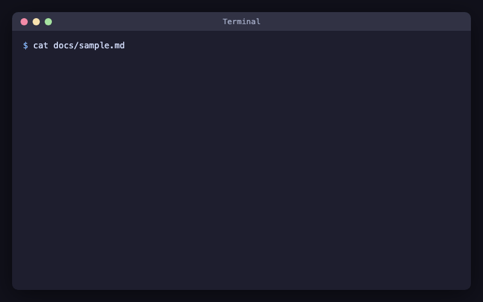

# glowm

A [Glow](https://github.com/charmbracelet/glow)-like Markdown CLI with Mermaid rendering for iTerm2/Kitty and PDF output.




## Usage

```bash
# Render Markdown to ANSI output
./glowm README.md

# Read from STDIN
cat README.md | ./glowm -

# Export Mermaid diagrams to PDF
./glowm --pdf README.md > diagram.pdf
```

## Options

- `-w` Word wrap width
- `-s` Style name (dark/light/notty/auto) or JSON style path
- `-p` Page output
- `--pdf` Export Mermaid diagrams to PDF via stdout

## Requirements

- Go
- Chrome/Chromium (required for Mermaid rendering and PDF export)

## Mermaid rendering

- iTerm2 / Kitty: Mermaid diagrams are rendered inline as images
- Other terminals: Mermaid blocks are shown as code

## Install (Homebrew)

```bash
brew tap atani/tap
brew install glowm
```

## Support

[](https://github.com/sponsors/atani)
