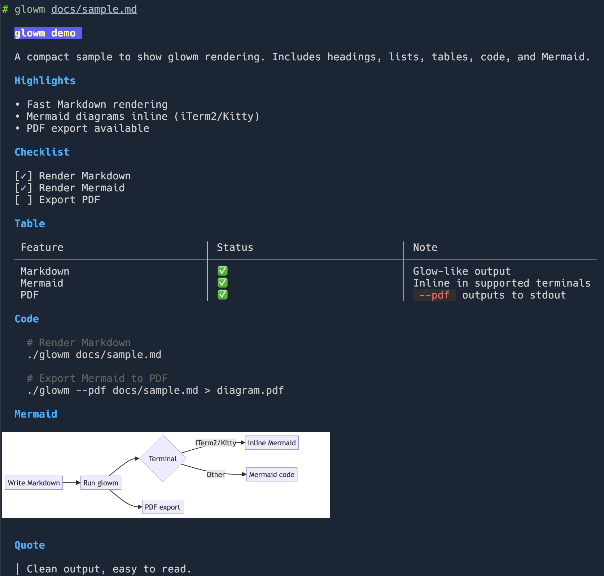

# glowm

[](https://codecov.io/gh/atani/glowm)

**Read Markdown architecture docs in your terminal — with Mermaid diagrams rendered inline.**

`glowm` is a terminal-first Markdown viewer for developers who keep design docs, ADRs, and diagrams next to the code. It renders Markdown beautifully in the terminal, displays Mermaid diagrams inline on modern terminals like iTerm2, Kitty, and Ghostty, and can export diagrams to PDF when you need to share them outside the terminal.

> Stop opening a browser just to preview Mermaid diagrams in Markdown.



## Why glowm?

Many engineering teams keep architecture notes, runbooks, ADRs, and design documents in Markdown. Mermaid makes those docs more useful, but most terminal Markdown viewers leave Mermaid blocks as plain code.

`glowm` keeps the whole workflow in your terminal:

- **Inline Mermaid diagrams** on iTerm2, Kitty, and Ghostty
- **PDF export** for Mermaid diagrams when you need an artifact
- **Pager-first reading** for long documentation files
- **STDIN support** for piping generated docs or command output
- **Glow-like Markdown rendering** with familiar terminal ergonomics

## Perfect for

- Reading architecture docs and ADRs without leaving the terminal
- Previewing Mermaid-heavy README files before committing
- Reviewing documentation in SSH sessions or terminal-only workflows
- Exporting diagrams from Markdown docs to PDF
- Teams that prefer docs-as-code over browser-only documentation tools

## Install

### Homebrew

```bash
brew tap atani/tap
brew install glowm
```

### Go

```bash
go install github.com/atani/glowm/cmd/glowm@latest
```

## Quick start

```bash
# Render Markdown to ANSI output
glowm README.md

# Read from STDIN
cat README.md | glowm -

# Export Mermaid diagrams to PDF
glowm --pdf README.md > diagrams.pdf
```

## Mermaid rendering

When stdout is a supported terminal, Mermaid code blocks are rendered inline as images:

- iTerm2
- Kitty
- Ghostty

On other terminals, Mermaid blocks gracefully fall back to code blocks.

Chrome or Chromium is required for Mermaid rendering and PDF export.

## Comparison

| Feature | glowm | Glow | Browser preview | VS Code preview |
| --- | --- | --- | --- | --- |
| Terminal Markdown reading | ✅ | ✅ | ❌ | ❌ |
| Inline Mermaid diagrams in terminal | ✅ | ❌ | ❌ | ❌ |
| Mermaid PDF export | ✅ | ❌ | Varies | Varies |
| Works with STDIN / pipes | ✅ | ✅ | ❌ | ❌ |
| Good for SSH / terminal-only workflows | ✅ | ✅ | ❌ | ❌ |
| Docs stay close to the codebase | ✅ | ✅ | ✅ | ✅ |

## Options

- `-w` Word wrap width
- `-s` Style name (`dark`, `light`, `auto`, `notty`, `ascii`, `dracula`, `pink`, `tokyo-night`) or JSON style path
- `-p` Force pager output, overriding `--no-pager`
- `--no-pager` Disable default pager; pager is on by default for TTY
- `--pdf` Export Mermaid diagrams to PDF via stdout
- `--show-link-urls` Show raw link URLs instead of just the link text (see [Links](#links))
- `--version` Show version information

## Links

In the terminal, `[text](url)` is shown as just `text`, rendered as an OSC 8
hyperlink that you can click on terminals that support it (iTerm2, Kitty,
Ghostty, and others). The URL is not printed inline, which keeps prose readable
and avoids the duplicated output bare URLs would otherwise produce.

When output is piped or redirected (a non-TTY), OSC 8 hyperlinks are not
clickable, so the raw URL is always kept to preserve the link target. Pass
`--show-link-urls` to always print the raw URL, including on a TTY.

Because the URL is hidden by default, the visible link text can differ from
the actual target (the usual OSC 8 hyperlink tradeoff). When viewing Markdown
from an untrusted source, run with `--show-link-urls` so you can see where each
link points.

## Config

`glowm` reads the config file from the OS-specific user config directory:

- **macOS**: `~/Library/Application Support/glowm/config.json`
- **Linux**: `~/.config/glowm/config.json` or `$XDG_CONFIG_HOME/glowm/config.json`
- **Windows**: `%AppData%\\glowm\\config.json`

Example:

```json
{
  "pager": {
    "mode": "less"
  },
  "mermaid": {
    "theme": "auto"
  }
}
```

### `pager.mode`

How the interactive pager behaves (default: `less`).

- `less` — scrolls a line at a time (`j`/`k`, arrows, mouse wheel), with
  half-page (`d`/`u`), page (`space`/`b`), `g`/`G` for top/bottom, and `/` `?`
  `n` `N` search. On Kitty-graphics terminals (Kitty, Ghostty), inline Mermaid
  diagrams scroll smoothly along with the text. This is the default.
- `more` — simple forward paging (`space` to advance, `b` to go back).
- `vim` — full-screen pager with a moving cursor line and Vim-style motions.

### `mermaid.theme`

Color theme for rendered Mermaid diagrams, applied to both inline images and
`--pdf` export (default: `auto`).

- `auto` — detect the terminal background and use `dark` on a dark background,
  otherwise the light default. Falls back to light when the background can't be
  detected (for example when exporting a PDF to a file). This is the default.
- `light` (alias `default`), `dark`, `forest`, `neutral`, `base` — force a
  specific [Mermaid theme](https://mermaid.js.org/config/theming.html).

## Requirements

- Go, when installing from source
- Chrome or Chromium, required for Mermaid rendering and PDF export
- A terminal with image support for inline diagrams: iTerm2, Kitty, or Ghostty

## Launch notes

Maintainers can use [`docs/launch-kit.md`](docs/launch-kit.md) for English launch copy and [`docs/global-launch-checklist.md`](docs/global-launch-checklist.md) for repository metadata and posting order.

## Contributing

Issues and pull requests are welcome. See [CONTRIBUTING.md](CONTRIBUTING.md) for development notes.

## Support

[](https://github.com/sponsors/atani)

## License

MIT. See [LICENSE](LICENSE).
