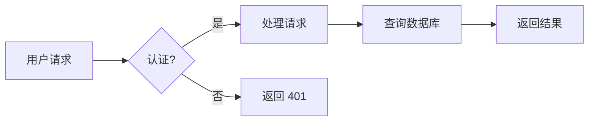
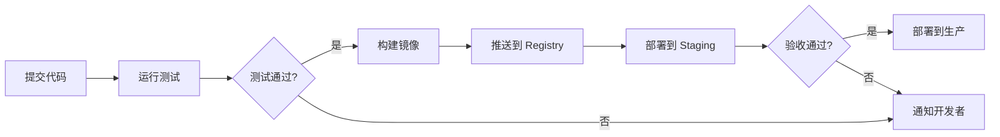

# Flowchart LR 测试

## 简单流程图

```mermaid
flowchart LR
    A[用户请求] --> B{认证?}
    B -->|是| C[处理请求]
    B -->|否| D[返回 401]
    C --> E[查询数据库]
    E --> F[返回结果]
```

## CI/CD 流程图

```mermaid
flowchart LR
    A[提交代码] --> B[运行测试]
    B --> C{测试通过?}
    C -->|是| D[构建镜像]
    C -->|否| E[通知开发者]
    D --> F[推送到 Registry]
    F --> G[部署到 Staging]
    G --> H{验收通过?}
    H -->|是| I[部署到生产]
    H -->|否| E
```
